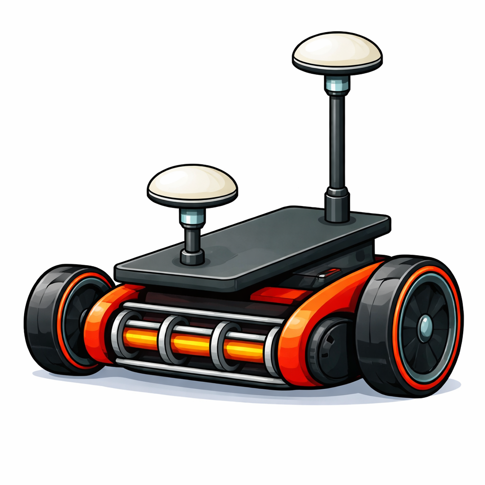
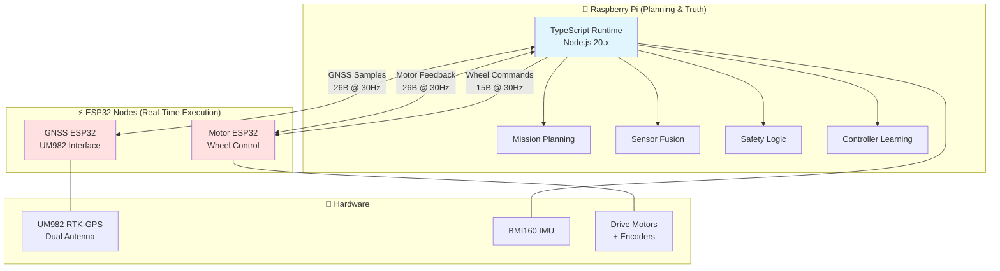

# Mower2026

**Autonomous robotic lawn mower with centimeter-level RTK-GPS precision**

Autonomous mower control system for Raspberry Pi, featuring RTK-GPS guided navigation, supervised self-learning controllers, and deterministic coverage planning. Built to run a modified Flymo H400 manual push mower.

## Current Runtime Documentation

For the currently implemented Pi runtime and sensor interfaces, use:

- [docs/functional-specification.md](./docs/functional-specification.md)
- [docs/system-map.md](./docs/system-map.md)
- [docs/sensors.md](./docs/sensors.md)

---

## 🎯 Project Vision

Transform a manual push mower into an autonomous system capable of:
- **Centimeter-level positioning** using RTK-GPS (2.5cm accuracy)
- **Self-learning motion control** through supervised tuning
- **Deterministic coverage planning** with efficient straight-line mowing patterns
- **Safe autonomous operation** with multi-layer fault protection

---

## ✨ Key Features

### Navigation & Control
- ✅ **RTK-GPS positioning** with dual-antenna UM982 receiver (30cm baseline)
- ✅ **Sensor fusion** combining GNSS, wheel odometry, and IMU (6-axis BMI160)
- ✅ **Self-learning turn controller** with direction-specific parameter adaptation
- ✅ **Self-learning drive controller** for straight-line precision

### Planning & Execution
- ✅ **Site capture** via manual drive with automatic waypoint sampling
- ✅ **Coverage planning** using orientation search and stripe decomposition
- ✅ **Obstacle avoidance** with polygon clipping
- ✅ **Mission start selection** from arbitrary mower placement
- ✅ **Lane execution** with turn/drive/arrive segment sequencing

### Safety & Reliability
- ✅ **Multi-layer safety**: Software watchdog, hardware timeout, physical e-stop
- ✅ **Quality gating**: RTK fix requirements, position accuracy thresholds
- ✅ **Fault monitoring**: Overcurrent detection, stall prevention, encoder validation
- ✅ **Graceful degradation**: Safe stops on sensor loss or confidence drop

### Development Infrastructure
- ✅ **Hardware abstraction**: Clean Pi/ESP responsibility separation
- ✅ **Transport portability**: I2C now, CAN-ready architecture
- ✅ **Telemetry logging**: JSONL session logs
- ✅ **Web dashboard**: Real-time monitoring at `http://<pi-ip>:8090`
- ✅ **Unit test coverage**: Protocol codecs, geometry, control algorithms

---

## 🏗️ System Architecture

### Computational Hierarchy

### Responsibility Demarcation

| Component | Owns | Does NOT Own |
|-----------|------|--------------|
| **Raspberry Pi** | Pose estimation, mission planning, safety decisions, controller tuning, parameter persistence | Real-time motor PWM, encoder counting, raw GNSS parsing |
| **GNSS ESP32** | UM982 communication, coordinate transforms, RTK correction handling, compact sample packaging | Sensor fusion, navigation decisions, mission logic |
| **Motor ESP32** | Wheel speed control, PWM generation, encoder counting, physical ramps (460ms up / 700ms down), watchdog | Path planning, guidance, cross-track correction |

---

## 🚀 Quick Start

### Prerequisites

**Hardware:**
- Raspberry Pi 4 (4GB+ recommended)
- UM982 dual-antenna RTK-GPS receiver
- BMI160 IMU (I2C address `0x69`)
- Two ESP32 nodes (GNSS + Motor)
- Modified Flymo H400 with motor controllers and encoders
- Game controller (manual mode input)

**Software:**
- Node.js 20.x (required for `i2c-bus` compatibility)
- Git
