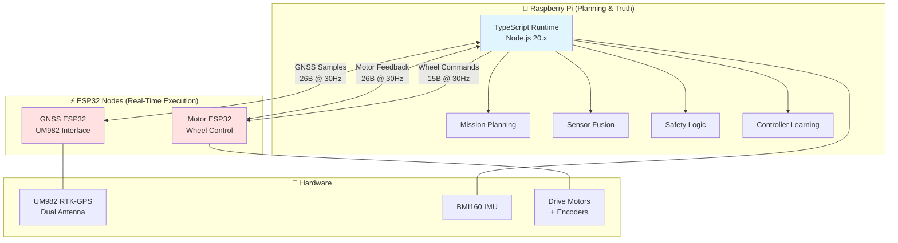

# Mower2026

**Autonomous robotic lawn mower with centimeter-level RTK-GPS precision**

Autonomous mower control system for Raspberry Pi, featuring RTK-GPS guided navigation, supervised self-learning controllers, and deterministic coverage planning. Built to run a modified Flymo H400 manual push mower.


## Current Runtime Documentation

For the currently implemented Pi runtime and sensor interfaces, use:

- [docs/functional-specification.md](./docs/functional-specification.md)
- [docs/system-map.md](./docs/system-map.md)
- [docs/sensors.md](./docs/sensors.md)

---

## 🎯 Project Vision

Transform a manual push mower into an autonomous system capable of:
- **Centimeter-level positioning** using RTK-GPS (2.5cm accuracy)
- **Self-learning motion control** through supervised tuning
- **Deterministic coverage planning** with efficient straight-line mowing patterns
- **Safe autonomous operation** with multi-layer fault protection

---

## ✨ Key Features

### Navigation & Control
- ✅ **RTK-GPS positioning** with dual-antenna UM982 receiver (30cm baseline)
- ✅ **[Pose fusion](./docs/pose-fusion.md)** combining GNSS, wheel odometry, and IMU (6-axis BMI160) with automatic quality tracking
- ✅ **Self-learning turn controller** with direction-specific parameter adaptation
- ✅ **Self-learning drive controller** for straight-line precision with CTE correction
- ✅ **Pure Pursuit path following** with adaptive lookahead and automatic pivot turns

### Planning & Execution
- ✅ **Site capture** via manual drive with automatic waypoint sampling
- ✅ **Path recording** during manual drive with 10cm point sampling
- ✅ **Path following** with smooth arc navigation and tight turn handling
- ✅ **Coverage planning** using orientation search and stripe decomposition
- ✅ **Obstacle avoidance** with polygon clipping
- ✅ **Mission start selection** from arbitrary mower placement
- ✅ **Lane execution** with turn/drive/arrive segment sequencing

### Safety & Reliability
- ✅ **Multi-layer safety**: Software watchdog, hardware timeout, physical e-stop
- ✅ **Quality gating**: RTK fix requirements, position accuracy thresholds
- ✅ **Fault monitoring**: Overcurrent detection, stall prevention, encoder validation
- ✅ **Obstruction recovery**: Event-driven retry system with context-aware recovery strategies
  - Line driving: reverse and retry forward (max 3 attempts)
  - Path following: retrace backwards 5 waypoints and resume
  - Turn recovery: escape turn and retry original heading
- ✅ **Graceful degradation**: Safe stops on sensor loss or confidence drop

### Development Infrastructure
- ✅ **Hardware abstraction**: Clean Pi/ESP responsibility separation
- ✅ **Transport portability**: I2C now, CAN-ready architecture
- ✅ **Telemetry logging**: JSONL session logs
- ✅ **Web dashboard**: Real-time monitoring at `http://<pi-ip>:8090`
  - Visual sensor displays: compass headings, pitch/roll level indicators
  - Motor current VU meters with peak hold
  - Turn and drive tuning interfaces with live results
- ✅ **Unit test coverage**: Protocol codecs, geometry, control algorithms

---

## 🏗️ System Architecture

### Computational Hierarchy



### Responsibility Demarcation

| Component | Owns | Does NOT Own |
|-----------|------|--------------|
| **Raspberry Pi** | Pose estimation, mission planning, safety decisions, controller tuning, parameter persistence | Real-time motor PWM, encoder counting, raw GNSS parsing |
| **GNSS ESP32** | UM982 communication, coordinate transforms, RTK correction handling, compact sample packaging | Sensor fusion, navigation decisions, mission logic |
| **Motor ESP32** | Wheel speed control, PWM generation, encoder counting, physical ramps (460ms up / 700ms down), watchdog | Path planning, guidance, cross-track correction |

---

## 🚀 Quick Start

### Prerequisites

**Hardware:**
- Raspberry Pi 4 (4GB+ recommended)
- UM982 dual-antenna RTK-GPS receiver
- BMI160 IMU (I2C address `0x69`)
- Two ESP32 nodes (GNSS + Motor)
- Modified Flymo H400 with motor controllers and encoders
- Game controller (manual mode input)

**Software:**
- Node.js 20.x (required for `i2c-bus` compatibility)
- Git

### Remote MCP Server For On-Mower Verification

This project includes an HTTP MCP server that runs on the mower and exposes a
small set of remote tools to a workstation agent. It is intended for cases
where the workstation only has a static clone, but you still need to build,
test, sync, and inspect logs against the real mower runtime.

- Source: [tools/mcp-server/](./tools/mcp-server/)
- Full guide: [docs/mcp-server.md](./docs/mcp-server.md)
- Exposed tools:
  - `getLatestLogs(n)` to fetch the latest mower session logs
  - `readFile(path, ...)` to inspect remote text files with tailing or regex filtering
  - `build` to run `npm run build` on the mower
  - `test` to run the mower test suite, optionally narrowed to specific test files or test names
  - `sync` to run `git fetch --all --prune` and `git pull --ff-only` on the mower

#### Mower Setup

Run these steps on the mower itself:

```bash
cd /home/mower/mower/tools/mcp-server
npm install
openssl rand -hex 32
sudo tee /etc/mower-mcp.env >/dev/null <<EOF
MOWER_MCP_TOKEN=<paste-token-here>
EOF
sudo chmod 600 /etc/mower-mcp.env

cd /home/mower/mower
sudo cp systemd/mower-mcp.service.template /etc/systemd/system/mower-mcp.service
sudo sed -i \
  -e "s|__MOWER_USER__|mower|g" \
  -e "s|__MOWER_GROUP__|mower|g" \
  -e "s|__MOWER_REPO_DIR__|/home/mower/mower|g" \
  /etc/systemd/system/mower-mcp.service
sudo systemctl daemon-reload
sudo systemctl enable --now mower-mcp.service
sudo systemctl status mower-mcp.service
```

The service listens on port `8765` by default. If the mower has a firewall,
allow LAN access to that port only.

#### Codex Desktop / CLI Setup

Add the MCP server to `~/.codex/config.toml` on the workstation:

```toml
[mcp_servers.mower]
url = "http://<mower-host-or-ip>:8765"
bearer_token_env_var = "MOWER_MCP_TOKEN"
startup_timeout_sec = 30
tool_timeout_sec = 600
```

Set the same token in the workstation environment before launching Codex:

```bash
launchctl setenv MOWER_MCP_TOKEN '<same-token-as-on-the-mower>'
```

Then fully restart Codex. In the desktop app, the MCP panel should show
`mower` as enabled, and agent threads should then be able to call the remote
tools.

#### Recommended Development Workflows

The MCP server removes the need for a Samba mount for build, test, and log
verification, but it does not replace the need for a writable source tree when
you want to edit code.

Use one of these workflows:

1. **Separate local clone on the workstation**
   - Edit files in your local checkout on the Mac.
   - Push the changes to the repo remote.
   - Call MCP `sync` on the mower so it pulls the new revision.
   - Call MCP `build` and `test` on the mower.
   - Call MCP `getLatestLogs` or `readFile` when you need runtime diagnostics.

2. **Samba-mounted live mower repo**
   - Edit files directly in the mounted mower working tree.
   - Call MCP `build` and `test` on the mower.
   - Call MCP `getLatestLogs` or `readFile` when you need runtime diagnostics.
   - `sync` is not needed in this case because you already edited the mower's
     live repo directly.

In short:
- **No Samba mount required** if you have a local clone and the mower MCP
  server is available.
- **Samba mount still works** and can be simpler when you intentionally want to
  edit the live mower repo in place.
- MCP verification always runs on the mower, not on the workstation clone.
- When full test output is too large, use a narrowed MCP `test` run and/or save
  the output and fetch it later with MCP `readFile`.

#### Claude Code Setup

If you are using Claude Code instead of Codex, add the server under
`mcpServers` in `~/.claude.json` as documented in
[docs/mcp-server.md](./docs/mcp-server.md).
