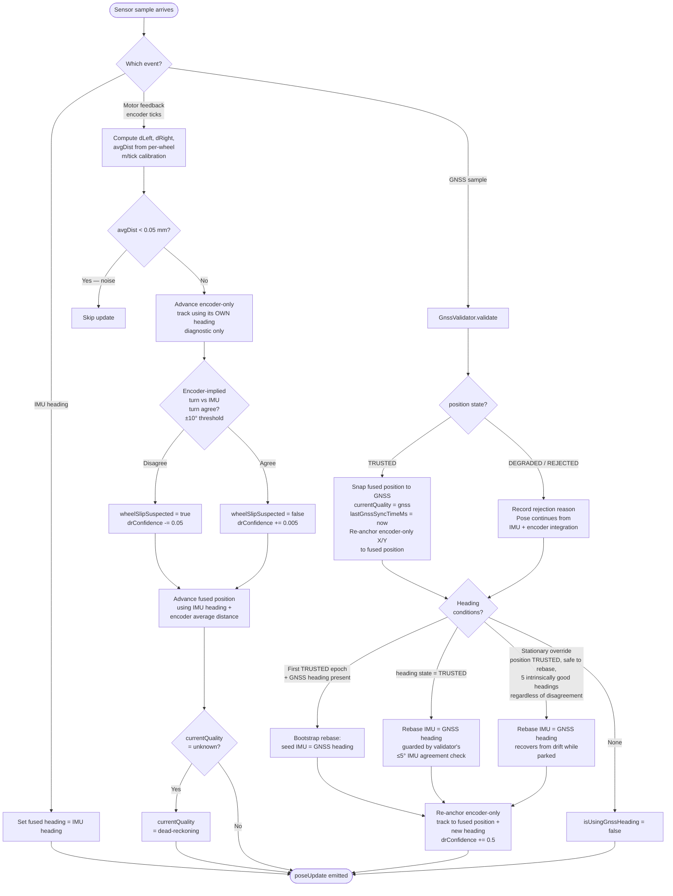
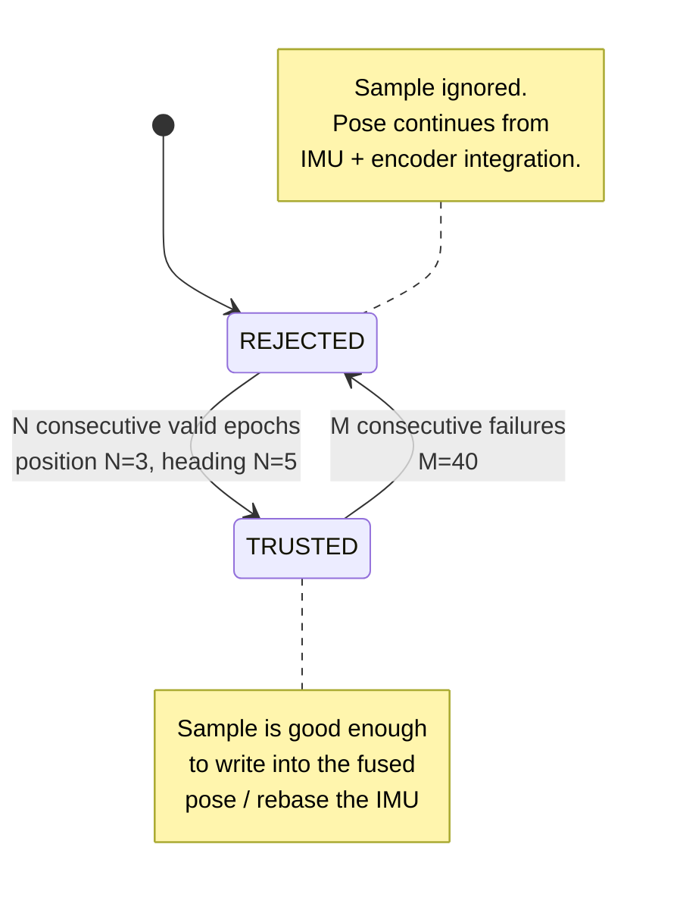

# Pose Fusion

This document describes how the mower combines GNSS, IMU, and wheel-encoder data into a single fused pose used by every navigation component.

The implementation lives in [`src/sensing/poseFusion.ts`](../src/sensing/poseFusion.ts) and the GNSS acceptance state machine in [`src/sensing/gnssValidator.ts`](../src/sensing/gnssValidator.ts).

---

## What pose fusion produces

A `Pose` consisting of:

| Field | Source of truth | Notes |
|---|---|---|
| `position` (X, Y meters, ENU plane) | GNSS when validator says **TRUSTED**, otherwise integrated by encoders | X = East, Y = North |
| `heading` (`InternalHeading`, 0° = +X, CCW positive) | IMU yaw, integrated continuously; rebased from GNSS only when validator says heading is TRUSTED | The IMU is always the live heading reference |
| `quality` | `"gnss"` \| `"dead-reckoning"` \| `"unknown"` | Demoted to dead-reckoning if no TRUSTED GNSS in `GNSS_STALE_TIMEOUT_MS` (2 s) |

A `poseUpdate` event fires on every contributing sensor input (encoder, IMU, GNSS), so subscribers always see the freshest fused state.

---

## Trust hierarchy in one sentence

> GNSS is the truth when the validator says so; IMU owns heading the rest of the time; encoders carry position forward when GNSS is silent or rejected.

There is **no DR-vs-GNSS agreement gate** — the validator alone decides whether GNSS may be trusted. If a sample passes the validator, the fused position snaps to it.

---

## Inputs and where they enter

| Input | Sensor controller event | Handler in `PoseFusion` |
|---|---|---|
| Encoder ticks (left, right) | `MOTOR_FEEDBACK_UPDATE` | `onMotorFeedbackUpdate` |
| IMU integrated heading (`InternalHeading`) | `IMU_HEADING_UPDATE` | `onImuHeadingUpdate` |
| GNSS position + heading + fix metadata | `GNSS_POSITION_UPDATE` | `onGnssPositionUpdate` |

The sensor controller polls each sensor on its own cadence (IMU ~125 Hz, motor feedback 50 Hz, GNSS 20 Hz); pose fusion is purely event-driven and stateless between events.

---

## End-to-end flow



---

## The GNSS validator state machine

`GnssValidator` runs two parallel state machines — one for position, one for heading. Each has three states:



`DEGRADED` is reserved in the type union but the current implementation only flips between TRUSTED and REJECTED via the consecutive-epoch counters.

### Position acceptance checks (all must pass)

- `fixType == "fixed"` (RTK Fixed only — float and single fail)
- Satellites in use ≥ **8**
- Reported position accuracy ≤ **5 cm**

### Heading acceptance checks (additional, on top of position)

- Position passed **this** sample (heading TRUSTED implies position TRUSTED)
- GNSS heading present and `headingValid` flag not false
- Heading-baseline length within **30 cm ± 5 cm** when reported
- Reported heading accuracy ≤ **1.0°**
- Sample-to-sample heading rate ≤ **20°/s**
- |GNSS heading − IMU heading| ≤ **5°**

### Promotion / demotion

- **Position promotes** to TRUSTED after **3** consecutive passes.
- **Heading promotes** to TRUSTED after **5** consecutive passes (heading is the stricter superset).
- **Either demotes** to REJECTED only after **40** consecutive failures, so a single noisy sample doesn't yank GNSS away from a healthy run.

These thresholds are configurable but the values above are the runtime defaults.

---

## Heading rebase — three paths into the IMU

The IMU is the live heading source. GNSS only writes into the IMU on a rebase. There are three rebase paths, in priority order:

1. **Bootstrap**: first time we ever see a TRUSTED position with a heading present, seed the IMU from GNSS so subsequent IMU-agreement checks aren't deadlocked by an unknown initial offset.
2. **Trusted-state rebase**: the heading state machine reports TRUSTED — the validator already verified the disagreement is ≤ 5°, so this is a small correction.
3. **Stationary override**: position is TRUSTED, the sensor controller reports the rebase is safe, and five consecutive samples pass every GNSS heading check except IMU agreement. The IMU is then rebased regardless of disagreement angle. Fix quality, position accuracy, heading validity, heading accuracy, antenna baseline, and sample-to-sample heading stability must remain good throughout the dwell; any failure or unsafe/moving state resets it. This lets a parked mower recover from arbitrarily large IMU drift without allowing one questionable GNSS sample to overwrite the IMU.

Every rebase also re-anchors the encoder-only diagnostic track and bumps DR confidence by 0.5.

---

## Encoder integration

Two parallel position tracks run from the same encoder feedback:

### Fused position track (the one consumers see)

On every motor-feedback sample with non-trivial movement (`avgDist > 0.05 mm`):

- **Per-wheel calibration** (`leftEncoderMetersPerTick`, `rightEncoderMetersPerTick`) converts ticks to meters. The dead-reckoning calibrator sets these per-wheel from a controlled forward + pivot run.
- **Average distance** drives forward position (`avgDist = (dLeft + dRight) / 2`).
- **Fused position** advances using the **IMU heading**, not the encoder-derived heading: `newX = x + avgDist · cos(IMU heading)`. The IMU yaw integrator is more accurate per-sample than the differential-drive heading estimate, so when both are available the IMU wins.

### Encoder-only diagnostic track

There is also an independent **encoder-only track** (`encoderOnlyX/Y/HeadingDeg`) that integrates purely from wheel differentials — never nudged by GNSS or IMU between rebases — exposed for the dashboard so an operator can see when GNSS and dead-reckoning agree. Its heading comes from the standard differential-drive formula:

```
encoderImpliedTurnDeg = (dRight − dLeft) / wheelbase   (in radians, then converted)
encoderOnlyHeading += encoderImpliedTurnDeg
encoderOnlyX += avgDist · cos(encoderOnlyHeading)
encoderOnlyY += avgDist · sin(encoderOnlyHeading)
```

This is why the wheelbase (`WHEEL_BASE_METERS_DEFAULT = 0.55 m` until calibrated) is load-bearing for the encoder-only track — and consequently for any switchover from GNSS to dead-reckoning. Wheelbase is also used by slip detection to compare encoder-implied turn against IMU turn.

### Encoder re-anchor on TRUSTED GNSS

Every TRUSTED-position GNSS update snaps the encoder-only X/Y to the freshly-snapped fused position, so when GNSS later drops out the dead-reckoning track is already starting from a known-good origin rather than from wherever it had drifted to. Encoder heading is also re-anchored whenever a heading rebase fires (any of the three rebase paths). Between rebases, encoder heading continues to integrate from wheel differentials so the diagnostic value still answers "what would dead-reckoning say if we trusted only the wheels?"

---

## Slip detection

Each motor-feedback sample with at least 1 mm of movement compares:
- `encoderImpliedTurnDeg = (dRight − dLeft) / wheelbase` (degrees)
- `imuTurnDeg = signed change in IMU heading since the last sample`

If `|encoderImpliedTurn − imuTurn| > 10°`, slip is suspected:

- `wheelSlipSuspected = true`
- `drConfidence -= 0.05`

If they agree:

- `wheelSlipSuspected = false`
- `drConfidence += 0.005` (slow recovery)

`drConfidence` decays much faster than it recovers by design — one bad sample is cheap to flag, but trust should rebuild gradually. The retry manager subscribes to slip events for obstruction recovery; the dashboard surfaces the flag.

---

## Quality reporting

The `quality` field on the returned `Pose` follows this logic:

```
"gnss"            ← lastGnssSyncTimeMs is fresh (<2 s old)
"dead-reckoning"  ← had GNSS once, but no TRUSTED sample in the last 2 s
"unknown"         ← never seen any input that produced a position
```

The 2-second `GNSS_STALE_TIMEOUT_MS` is a *wallclock arrival* check, not the receiver-claimed sample age — the validator handles `sampleAgeMillis` separately.

---

## Typical behaviour — happy path

A normal mowing session looks like this:

1. **Boot.** No GNSS yet → `quality = "unknown"`, position = (0, 0), IMU integrating from its own bias-calibrated baseline.
2. **First few GNSS epochs.** Validator runs through its 3-epoch window. Position promotes to TRUSTED. Fused position snaps to GNSS, `quality = "gnss"`, encoder-only track is seeded from the same anchor.
3. **First valid heading.** Bootstrap rebase fires once GNSS heading is present. IMU is seeded from GNSS — the only time GNSS heading writes the IMU without going through the 5° agreement gate.
4. **Steady mowing under open sky.** Each TRUSTED GNSS sample snaps fused position to GNSS. Between samples (and on every encoder tick or IMU tick), the fused pose advances using IMU heading and encoder distance. Heading state machine remains TRUSTED, so each sample also pulls IMU back toward GNSS by the small validator-permitted step. `quality = "gnss"` throughout.
5. **Stop and settle.** Once the sensor controller reports that heading rebasing is safe, five consecutive intrinsically good GNSS headings trigger the **stationary override** even if IMU drift is very large. This is the path that prevents the agreement gate from permanently blocking recovery.

---

## Occasional behaviour — degraded inputs

### GNSS goes single / float / no-fix

- Validator rejects every sample with `fix_not_rtk_fixed`.
- After 40 consecutive rejects, position state demotes to REJECTED. Heading too.
- After **2 s** of no TRUSTED sample, `quality` demotes to `"dead-reckoning"`.
- Fused position keeps advancing on encoders + IMU. The mower can keep driving, but downstream code that gates on `pose.quality === "gnss"` will hold off (e.g. some learning updates).
- When RTK Fix returns: 3 epochs to re-promote position, then position snaps back to GNSS in one step. The encoder-only track is also re-seeded so its drift integration restarts cleanly.

### GNSS accuracy degraded but still RTK Fixed

- `accuracy_high` rejection (> 5 cm reported accuracy). Same demotion path as above.
- This is the path that fires under partial sky obstruction (overhanging trees, walls).

### GNSS heading rejected but position fine

- Heading state machine demotes independently; position state stays TRUSTED.
- Fused position still snaps to GNSS each epoch. IMU is **not** rebased.
- Common during stop-start motion where GNSS heading goes briefly invalid: `heading_invalid_flag` or `heading_disagrees_with_imu` rejections.
- Recovery: 5 consecutive valid heading epochs to re-promote, *or* the stationary override path if the operator parks the mower.

### Encoder slip / wheel spin

- `wheelSlipSuspected = true`, `drConfidence` decays toward 0.
- Fused position **still updates on every tick** (the slip flag is informational, not a gate). If GNSS is TRUSTED, slip is benign because the next epoch snaps the position back to truth.
- If GNSS is REJECTED for an extended period **and** slip is suspected, the position estimate will drift. The retry manager and the obstruction detector use the slip flag as one piece of evidence for triggering recovery.
- The independent encoder-only track is unaffected by GNSS snaps, so the dashboard can show how far the dead-reckoning has wandered from truth.

### IMU bias drift (long stationary period)

- Sensor controller auto-recalibrates IMU yaw bias after the mower has been stationary for an extended idle period (≥ 30 minutes), using a recent stationary window.
- Up to that point, slow yaw drift accumulates into the integrated IMU heading.
- The stationary override rebase compensates each time GNSS is good and the mower is parked, so most operators never see this in practice.

### GNSS heading disagrees with IMU mid-drive

- `heading_disagrees_with_imu` rejection — both `> 5°` from each other.
- Heading state machine demotes after 40 consecutive samples. IMU is no longer being nudged.
- Fused position still snaps to GNSS (position acceptance is independent).
- The mower is now relying on IMU heading + GNSS position. CTE control still works; segment learning runs that need pose quality may be deferred by their callers.
- Recovery requires either a full 5° re-agreement window to re-promote, or the operator stopping so five consecutive intrinsically good GNSS headings can rebase the IMU regardless of disagreement.

### GNSS sample-to-sample teleport

- No physical-jump check is used.
- There is currently no calibrated mower translational-speed model, so meters-per-second plausibility gates are intentionally forbidden in validator logic.
- The temporal filter (3 consecutive valid epochs before promotion) plus the strict RTK Fixed + ≤ 5 cm accuracy filter is the only protection.
- A single rogue sample that happens to claim RTK Fixed will snap position once, but the validator's 3-epoch promotion window means it would need 3 in a row to do lasting damage.

### GNSS link silent at the I2C layer

- `lastGnssSyncTimeMs` stops advancing.
- After 2 s wallclock, `pose_fusion.gnss_position_silent` warning logged once and quality demotes to `"dead-reckoning"`.
- Validator state machines are unaffected (no inputs to advance) — when samples return, the existing TRUSTED state holds, but the `2 s stale` flag is cleared on the first new accepted sample.

---

## What pose fusion does NOT do

- **It does not consult dead-reckoning to gate GNSS.** DR vs GNSS disagreement is *diagnostic* (the encoder-only track is exposed for the UI), never a validator input.
- **It does not blend GNSS and DR position.** When validator says TRUSTED, fused position is a hard snap to GNSS; when REJECTED, fused position is pure DR. There is no weighted average.
- **It does not own the IMU yaw integrator.** That lives in `SensorController`; pose fusion only reads the integrated heading and writes new baselines via `setHeading()` on rebase events.
- **It does not check for physical-jump teleports.** Speed-based plausibility gates are intentionally excluded until the project explicitly defines a calibrated mower-speed model.

---

## Diagnostics

- `getDiagnosticSnapshot()` returns a single bundle (fused state, encoder-only track, calibration, last GNSS event, last rejection reason and age, blend separation) for the per-drive heartbeat. Designed to be sampled at ~5 Hz during a drive.
- `pose_fusion.gnss_rejected.<reason>` warnings are rate-limited to once per second per reason, so a long degraded run produces tractable log volume.
- `pose_fusion.wheel_slip_suspected` fires once on each transition into the suspected state.
- `pose_fusion.gnss_heading_rebase_stationary_override` fires whenever the wide-tolerance stationary path is used, with the disagreement and yaw rate at the moment of rebase.

---

## Related files

- [src/sensing/poseFusion.ts](../src/sensing/poseFusion.ts) — fusion implementation
- [src/sensing/gnssValidator.ts](../src/sensing/gnssValidator.ts) — GNSS acceptance state machine
- [src/sensing/sensorController.ts](../src/sensing/sensorController.ts) — IMU yaw integration, sensor poll cadence, `setHeading` for rebase
- [src/config/poseCalibration.ts](../src/config/poseCalibration.ts) — encoder per-wheel m/tick and wheelbase persistence
- [docs/sensors.md](./sensors.md) — sensor boundary contract and primitives
- [docs/heading-types-guide.md](./heading-types-guide.md) — branded heading types used here
